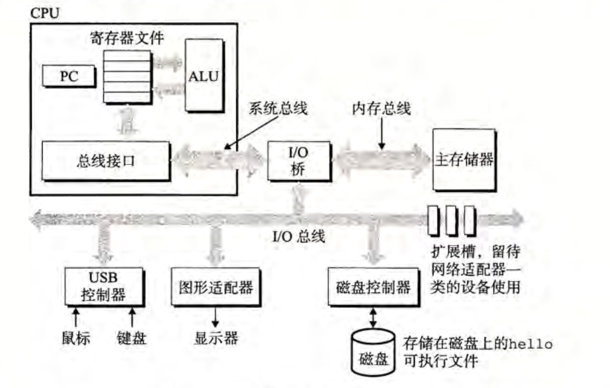
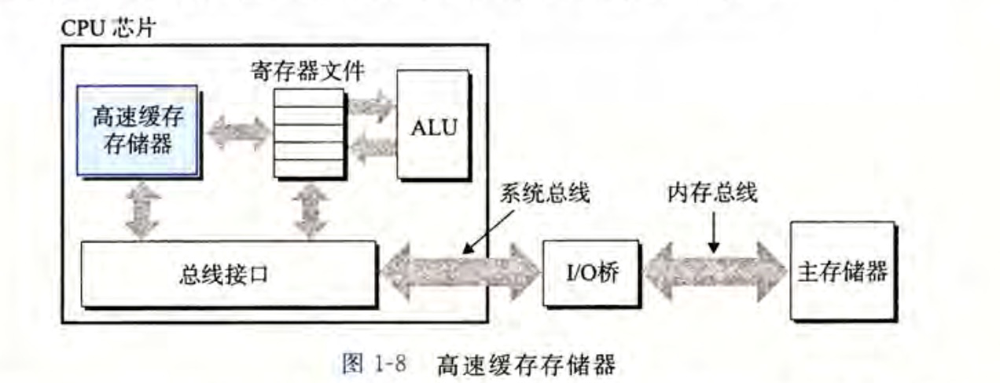
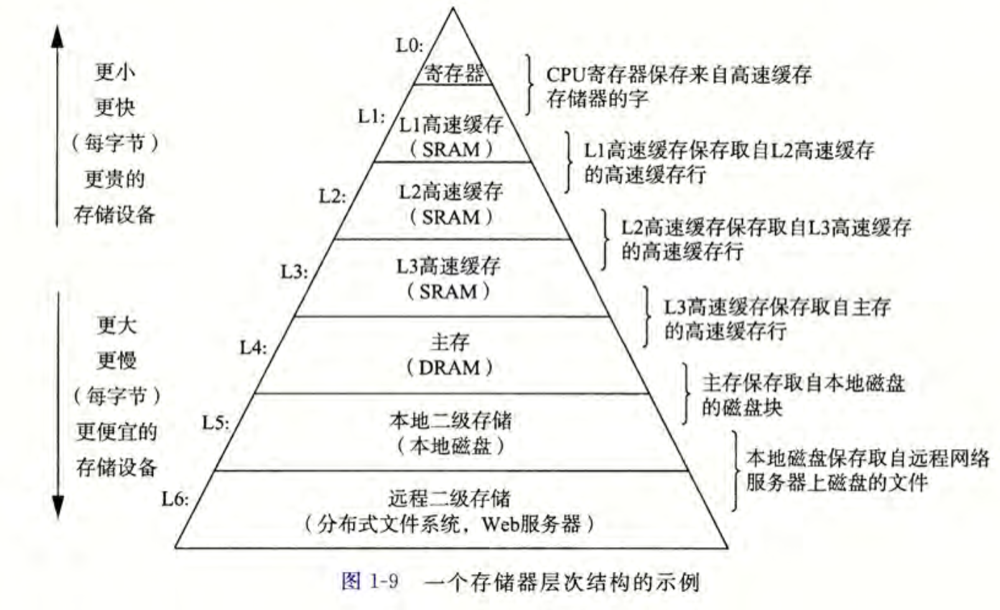
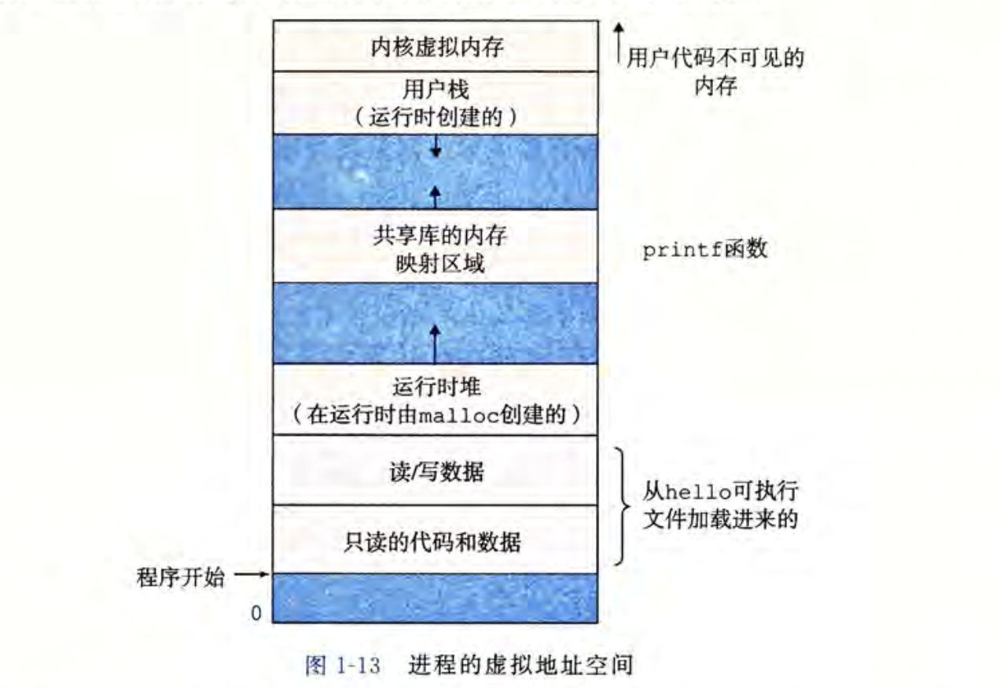

[TOC]

# os_notebook

## Introduction

- This is a operating system learning notebook

- Ref: \

  [南京大学-操作系统](https://www.bilibili.com/video/BV1N741177F5?p=3&spm_id_from=pageDriver)\

  [Operating Systems: Three Easy Pieces](https://pages.cs.wisc.edu/~remzi/OSTEP/)\

  [南京大学 计算机系统基础](https://nju-projectn.github.io/ics-pa-gitbook/ics2021/index.html)\

	[深入理解计算机系统](https://baike.baidu.com/item/深入理解计算机系统/4542223)\

  [Source Code](https://github.com/remzi-arpacidusseau/ostep-code)\
	

## Supported

- os
  
  Ubuntu 16.04 LTS
  
- compiler
  
  gcc version 9.4.0
-   This is os lab notebook 

## Start

```bash
git clone git@github.com:DC-Jade/c_notebook.git
```

~~## PA1~~

-   [Turing machine, TRM](https://en.wikipedia.org/wiki/Turing_machine)
    -   while (1) { get instruction; run instruction; update instruction; }
-   状态机模型
    -   $多元组(PC, R_1, ..., R_n， mermory)$
    -   [Program counter, PC](https://en.wikipedia.org/wiki/Program_counter)
    -   $R_i(i = 1, ..., n), register$
-   [ISA](https://en.wikipedia.org/wiki/Instruction_set_architecture)
    -   指令集架构， 硬件无关的机器指令集的集合
-   地址映射
    -   pmem

## Program 程序

### Intrinsic 本质

1. state machine

   - $tuple(pc, r_1, ..., r_n， mermory)$

   - [program counter, pc](https://en.wikipedia.org/wiki/Program_counter)

   - $r_i(i = 1, ..., n), register$ x86

     ​	rip -> pc ; r[abcd]x ; rbp -> begin ptr of stack ; rsp -> stop ptr of stack, controlling stack

2. computing + syscall

   - computing program

     up to 99%

   - syscall

     store process status and managing process

- function

  - intrinsic

    stack and frame

  - function call

    push frame

  - function return

    pop frame

```bash
cd src/
mgcc hanoi.c  # -g is required for gdb
gdb ../bin/hanoi
	layout src
	wa $rax  # watch point, trace register rax

# min_hello.S
gcc -c min_hello.S && ld min_hello.o -o ../bin/min_hello
```

## Compile process 编译过程 

.c(src) -> (preprocessing, gcc -I) -> .I -> (compiling, gcc -E) -> .S(assembly code) 

-> (assembling, gcc -c) -> linking(ld || gcc -o) -> .o(ELF, object code)

## operating system, OS 操作系统

- ~~硬件：C程序~~
- ~~应用程序： 系统调用API的集合~~

### Intrinsic

1. machine 

​	C program

2. application program

​	syscall APIs

## Virtualisation 虚拟化

### Abstraction

Abstraction makes it possible to write a large program by dividing it into small and under- standable pieces

- CPU
- Virtual Memory
  - abstraction of main memory

- File
  - abstraction of I/O devices

- Protection
- Isolation

## Concurrency 并发

- Definition

  running  instructs of process/thread  by turns

- Multiple threads

- Atomic

- Plot status machine 

- 互斥

```bash
cd ../include
wget http://jyywiki.cn/pages/OS/2022/demos/thread.h
cd ../src
mgcc multi_thread.c -l pthread && ../bin/multi_thread
```


## Persistence 持久性

## Scripts(.sh)

```bash
mgcc () {
  arg1=$1;  # .c file
  arg2=${@:2:10}  # argments
  # -g - debug information
  gcc $arg1 -Wall -g $arg2 -o ../bin/${arg1%\.c}
}
```

## Basics

### Hardware Composite Model





- Main memory

  主存是一个临时存储设备，在处理器执行程序时，用来存放程序和程序处理的数据,主存是由一组动态随机存取存储器(DRAM)芯片组成的; 从逻辑上来说，存储 器是一个线性的字节数组，每个字节都有其唯一的地址(数组索引)

- CPU

  中央处理单元(CPU),简称处理器，解释(或执行)存储在主存中二进制指令。主要由ALU （算术逻辑单元）和 PC（程序计数器）

  ALU处理指令，进行状态计算，如；PC是一个大小为一个字的存储设备(或寄存器)，指向主存中的某条机器语言指令(即含有该条指令的地址；

- Memory Hierarchy

  

### Process



### Bit

- Bit，二进制数字
- Byte，字节；8位bit，最小寻址的内存单位
- Word，字; 16位bit
